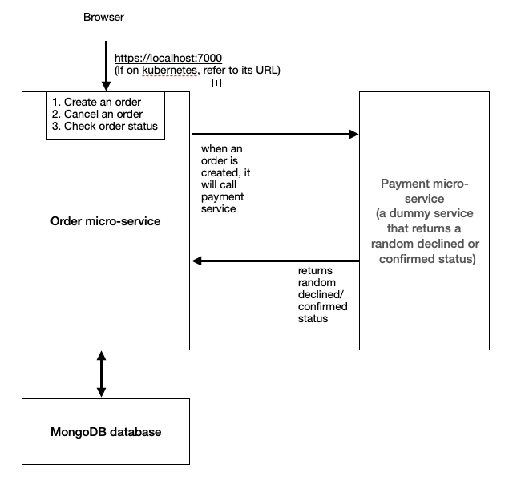

<br>

# Overview

This is a sample order-payment microservices application that also has an example of cloud-deployable infrastructure using Kubernetes Helm chart.

- [x] Use NodeJS framework (NestJS is used)
- [x] Unit test (Refer to ./backend-order-mgmt-system/src/orders/orders.service.spec.ts)
- [x] Proof of cloud-deployable structure (Refer to ./k8s folder and instructions below)
- [x] Eslint is used

<br>



<br>

## Available endpoints

### /orders 
- POST with raw JSON data: Create an order
- GET: Find all orders
### /cancel/:id
- PATCH: Cancel an order
### /status/:id
- GET: Get order status

<br>

# 1. Run all micro-services locally on computer

## Pre-requisites

1. [Docker Desktop 4.3.2](https://www.docker.com/products/docker-desktop)

## Commands

In the main backend-engineer-practical-assignment directory, run the following command and it will build all the related micro-services:

```bash
$ docker-compose up
```

Hot-reloading is already configured for order microservice.
Save the page and the changes will be automatically reloaded.

### Examples

- POST http://localhost:7000/orders with body raw JSON data: To create an order
- GET http://localhost:7000/orders : To get all orders
- GET http://localhost:7000/orders/status/61dab58a954be9d3cac9566f : To get an order (id: 61dab58a954be9d3cac9566f) status  
- PATCH http://localhost:7000/orders/cancel/61dab58a954be9d3cac9566f : To cancel an order (Order status changed to ORDER_CANCELLED)

<br>

# 2. Deploy to kubernetes

## Pre-requisites
1. hyperkit
2. minikube (will install kubectl)

## Commands

### 1. In the main directory, start:

```bash
$ minikube start --vm-driver=hyperkit
```

### 2. Build order and payment docker images in minikube 
(The policy currently is set to pull from minikube's environment to illustrate docker environment. Feel free to change the policy if prefer to pull from Docker Hub)

```bash
# use minikube's docker env - !important
$ eval $(minikube docker-env) 

# Build order microservice
$ cd backend-order-mgmt-system/
$ docker build --no-cache --progress=plain -t order-micro-svc:v1.0 .

# Build payment microservice
$ cd ..
$ cd microservice-payment/
$ docker build --no-cache --progress=plain -t payment-micro-svc:v1.0 .

# Go back to main directory
$ cd .. 
```

### 3. Helm install to Kubernetes

Folder k8s is the location for all the kubernetes yaml files

```bash
$ helm install ./k8s --generate-name
```

For dry-run:
```bash
$ helm install ./k8s --dry-run --generate-name
```

### 4. Check that all services is running

```bash
$ kubectl get all
```

Expected output if success (eg. status will be 'Running'):
```bash
NAME                                              READY   STATUS    RESTARTS   AGE
pod/mongodb-deployment-74d8d4b589-zfdjd           1/1     Running   0          2m8s
pod/order-micro-svc-deployment-7486b78bcf-8zsnj   1/1     Running   0          2m8s
pod/payment-deployment-87c578547-zgjkt            1/1     Running   0          2m8s
```

### 5. Allow external access

```bash
$ minikube tunnel

# Get the url
$ minikube service order-micro-svc --url
```

To monitor logs generated:

```bash
kubectl logs -f <POD-NAME>
```

<br>

## To-do

- [ ] Complete unit test
- [ ] Integration test

<br>

## Stay in touch